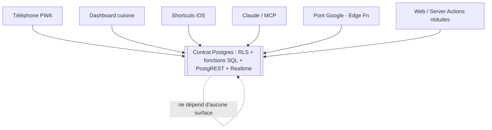
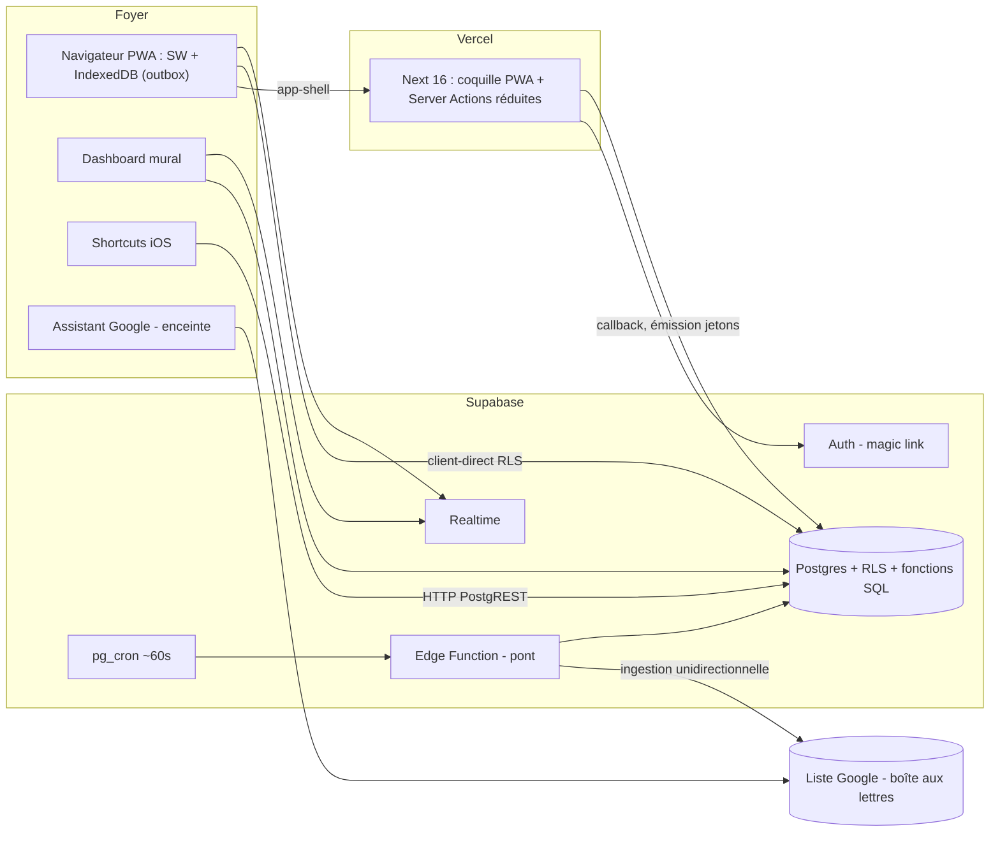
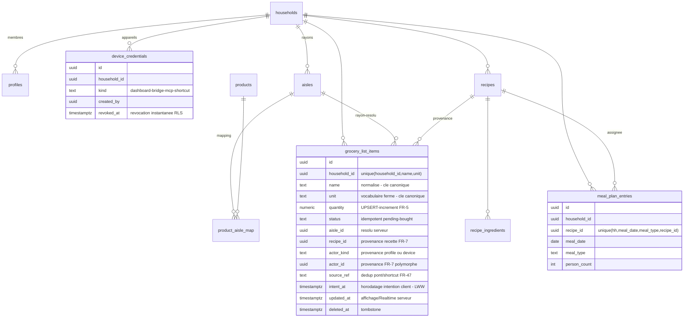

# Architecture Spine — NutriClaude

## Design Paradigm

**Local-first thin-client sur un contrat Postgres partagé.** La liste de courses est une **donnée**, pas une app : Postgres en est la source unique et l'autorité. Cinq surfaces de rang égal (téléphone PWA, dashboard cuisine, Shortcuts iOS, Claude/MCP, pont Google) plus le web sont des **adaptateurs minces** au-dessus d'un contrat stable — PostgREST + Realtime — dont les règles (RLS, contraintes, fonctions SQL) sont la vérité et l'application. Toute surface écrit optimiste en local (cache + outbox), converge par LWW arbitré serveur, et se propage par Realtime. Aucun moteur de sync tiers.

- Contrat / autorité → schéma `supabase/migrations`, fonctions SQL, politiques RLS.
- Coquille & surfaces web → `app/` (Next 16 App Router), `lib/supabase/`.
- Réplication cliente → service worker + IndexedDB (outbox), `public/`.
- Pont & planifié → `supabase/functions/` (Edge Functions) + `pg_cron`.

## Invariants & Rules

### AD-1 — Contrat Postgres partagé, surfaces minces [ADOPTED]
- **Binds:** all ; FR-19..23, FR-20, NFR-5
- **Prevents:** deux surfaces qui appliqueraient des règles divergentes ; toute règle métier dupliquée hors base.
- **Rule:** toute règle métier vit en Postgres (RLS + contraintes + fonctions SQL). L'API stable = PostgREST (dont la vue `grocery_list_by_aisle`) + Realtime, versionnée ; aucune surface ne produit un état que les autres jugeraient invalide. Chaque surface est un adaptateur mince, jamais un dépôt de règles.

### AD-2 — Postgres seule autorité ; RLS non contournable ; jamais de SERVICE_KEY [ADOPTED]
- **Binds:** all chemins d'écriture ; FR-39, NFR-5
- **Prevents:** un chemin qui court-circuite l'isolation foyer (tension MCP/pont) ; une règle cliente traitée comme vérité.
- **Rule:** l'isolation foyer (NFR-5) est appliquée **au niveau de la donnée** par la RLS, ancrée sur `current_household_id()` sur les 10 tables. Aucune surface n'utilise `SUPABASE_SERVICE_KEY` ni aucun chemin bypass RLS (MCP, pont, dashboard inclus) — la tension FR-39 est dénouée structurellement, pas par vigilance. Toute règle appliquée hors base (résolution provisoire hors-ligne) est **jamais autoritaire** et ré-arbitrée au flush.

### AD-3 — Ligne canonique unique + convergence LWW par champ arbitrée par horodatage d'intention client
- **Binds:** schéma de toute table mutable (`grocery_list_items` en premier) ; NFR-2
- **Prevents:** résurrection non voulue d'un article supprimé ; un cochage flushé en retard qui écrase une modif de quantité plus récente ; deux lignes divergentes pour le même achat (l'id sur lequel s'arbitre LWW/tombstone doit rester stable).
- **Rule:** un article de liste est **unique par `(household_id, nom normalisé, unité)`** — contrainte d'unicité en base. Il n'existe donc jamais deux lignes à fusionner : `status` et `deleted_at` vivent sur cette ligne canonique. Chaque mutation de l'outbox porte un **horodatage d'INTENTION** (horloge client, heure du geste) + le champ visé ; le serveur garde, **par champ mutable** (`status`, `quantity`, `name`, `aisle_id`, `deleted_at`), la valeur dont l'intention est la plus récente — **pas** l'heure d'arrivée. Un cochage de 09:00 flushé à 09:30 n'écrase pas une modif de quantité de 09:05 (champs différents ; et à champ égal, l'intention la plus récente gagne). Suppression = tombstone `deleted_at`, **jamais** DELETE dur. `updated_at` serveur reste l'horodatage d'affichage/Realtime, pas l'arbitre. Dérive d'horloge client = risque **assumé** à cette échelle (2 appareils/foyer), pas un ordre global.

### AD-4 — Toggle `status` idempotent
- **Binds:** cocher/décocher (FR-3) ; NFR-2
- **Prevents:** le bug actuel (toggle relatif codé en dur) ; un conflit quand deux surfaces cochent le même article.
- **Rule:** `status` (pending/bought) est une **valeur posée** sur la ligne canonique (AD-3), pas un basculement relatif. Cocher un article déjà coché ailleurs converge sans conflit. Suppression et modif de quantité ne sont pas idempotentes → passent par tombstone / LWW.

### AD-5 — Outbox locale ordonnée, rejouée au premier plan
- **Binds:** tout chemin d'écriture des surfaces liste ; NFR-1
- **Prevents:** une écriture perdue au retour réseau ; une UI qui bloque hors-ligne.
- **Rule:** les intentions d'écriture s'accumulent dans une file locale **ordonnée** (IndexedDB), rejouée au retour réseau **et au premier plan** de l'app. Pas de Background Sync iOS (resync à la réouverture, assumé). Le cache de lecture local est jetable ; Supabase est le magasin durable, repull à la réouverture.

### AD-6 — Autorité serveur des règles de liste ; agrégation et génération sur clé canonique
- **Binds:** FR-4 (rayon), FR-5 (agrégation), FR-15..17 (menu/génération), FR-16 (échelle)
- **Prevents:** deux surfaces qui classeraient/agrégeraient différemment ; un client qui fige un rayon faux ; une génération qui détruit des ajouts ; un doublon d'assignation qui double les quantités.
- **Rule:** résolution de rayon, agrégation et mise à l'échelle sont **autoritaires côté serveur** (fonctions SQL). **Agrégation = UPSERT-incrémente sur la clé canonique `(household_id, nom normalisé, unité)`** (AD-3) : « ajouter » n'est **jamais** un INSERT nu (FR-5) — même clé pour l'agrégation à l'ajout ET entre recettes d'une génération. **Génération non destructive (FR-17)** : elle ne **SUPPRIME jamais** les articles à acheter existants (corrige le DELETE actuel), UPSERT-incrémente sur la clé canonique, et annonce le nombre ajouté ; un article tombstoné réclamé par la génération n'est **ressuscité que si l'intention de génération > intention de suppression** (LWW `deleted_at`, AD-3). `meal_plan_entries` porte `unique(household_id, meal_date, meal_type, recipe_id)` (empêche le doublon d'assignation). Hors-ligne, le client applique une résolution de rayon **provisoire** ré-arbitrée au flush — un article peut changer de rayon au retour réseau (attendu).

### AD-7 — Vocabulaire d'unités fermé
- **Binds:** FR-52, FR-5, FR-16
- **Prevents:** l'addition/conversion de deux unités hétérogènes ; « 1,67 oignon ».
- **Rule:** unités = liste fermée `g, kg, ml, L, pièce, cs, cc, pincée`. Deux unités différentes ne sont jamais additionnées ni converties (deux lignes). Les quantités mises à l'échelle sont arrondies à une valeur achetable.

### AD-8 — Propagation par Supabase Realtime, jamais de polling
- **Binds:** FR-10, FR-22, FR-27
- **Prevents:** une surface qui interroge en boucle ou exige un rechargement manuel.
- **Rule:** propagation inter-surfaces = souscription **Realtime par foyer**. Jamais de polling, jamais de reload manuel. Hors-ligne, la surface affiche le dernier état local + les actions en attente (pastille « arrive… »).

### AD-9 — Identité d'appareil scopée foyer, révocable à l'unité
- **Binds:** FR-21, NFR-6 ; toutes politiques RLS
- **Prevents:** un appareil traité comme une personne ; une révocation impossible à l'unité ; un jeton révoqué qui continue d'agir.
- **Rule:** chaque surface non-humaine (dashboard, pont, MCP, Shortcut) = une ligne `device_credentials` (household_id, kind, scope restreint, created_by, revoked_at) et un jeton portant le claim `household_id`. `current_household_id()` résout le foyer depuis **le profil humain** (`profiles.id = auth.uid()`) **ou** le claim du jeton (`auth.jwt()`). Les politiques joignent `device_credentials` et exigent `revoked_at IS NULL` → **révocation instantanée** même jeton non expiré. Périmètre restreint à la liste ; jamais d'accès admin foyer.

### AD-10 — Appairage dashboard sans login
- **Binds:** FR-28, FR-32
- **Prevents:** un écran mural qui demande une connexion ; une session personnelle laissée ouverte à vie.
- **Rule:** Florian, connecté au web, émet une identité d'appareil « dashboard » (URL/jeton) ouverte **une fois** sur l'écran mural, qui persiste le jeton et **ne redemande jamais de login**. Révocable depuis le web. Aucune manip requise de la conjointe.

### AD-11 — Auth humaine = magic link sans mot de passe [ADOPTED, code à réaligner]
- **Binds:** seul mode d'authentification humaine
- **Prevents:** la réintroduction d'un mot de passe qui déplace le test d'acceptation « elle ne configure rien ».
- **Rule:** authentification humaine = Supabase Auth magic link, **sans mot de passe**. Invariant produit, pas un détail révocable par un architecte. Le code a dérivé (email+mdp) → à réaligner en Lot 0.

### AD-12 — Pont Google : ingestion unidirectionnelle, idempotente, device-credentialed
- **Binds:** FR-29, FR-31, FR-47..50, FR-52, NFR-4, NFR-12
- **Prevents:** Google traité comme source de lecture ; une double ingestion (rejeu pg_cron) ; un article vocal qui ne fusionne pas faute d'unité ; une fuite de secrets au-delà de la seule liste.
- **Rule:** le pont est un job d'ingestion à identité d'appareil, **unidirectionnel** (Google → NutriClaude), **idempotent**, **marque-sans-supprimer** côté Google (purge périodique). **Idempotence = colonne `source_ref`** (référence de la ligne source Google/Shortcut) : un rejeu ne réinsère pas. L'ingestion **normalise** vers le vocabulaire d'unités fermé (FR-52) avec une **unité par défaut**, de sorte que « lait » vocal fusionne avec la ligne canonique `lait / L` (AD-3/AD-6). NutriClaude ne fait jamais confiance à Google comme source de lecture (FR-50). Latence ~60s **structurelle** (cycles pg_cron, pas de notification) : aucune surface ne montre un article dicté « déjà là ». Rupture → foyer prévenu côté web/Claude (FR-49), accumulation récupérée au rétablissement (FR-48). Secrets : compte tiers dédié, chiffré, révocable, moindre privilège (NFR-12).

### AD-13 — Client PWA en client-direct Supabase + outbox ; Next = coquille
- **Binds:** FR-35, NFR-1, NFR-11 ; surfaces liste
- **Prevents:** un retour au tout-`force-dynamic` ; un chemin d'écriture qui exige le réseau.
- **Rule:** les surfaces liste **lisent/écrivent via le client Supabase du navigateur** (RLS-enforced) + outbox IndexedDB — pas via Server Actions. Next 16 = **coquille PWA** : service worker (precache app-shell, données en IndexedDB), manifeste, cible de partage web. Server Actions / route handlers réduites à l'irréductible serveur. **Critère de cause, et non d'analogie** (précisé le 2026-07-28, revue Epic 1 passe 2) : une écriture passe par une Server Action si — et seulement si — elle **exige un secret serveur**, ou si **sa conséquence doit être visible dans un rendu serveur** (`revalidatePath`). Tout le reste part du navigateur. Conséquence pratique : `generate_household_invite` est `security definer` et n'exige aucun secret ; il relève de la Server Action par la *seconde* branche seulement — l'écran du foyer est rendu côté serveur. La déconnexion relève de la même branche. Le rachat d'invitation, la création de foyer et le renommage partent du client. L'ancienne formulation nommait des cas (« émission de jetons + invitations ») plutôt que la raison, et classait donc par ressemblance de vocabulaire : AD-2 interdisant toute `SERVICE_KEY`, les jetons d'appareil de l'Epic 5 passeront eux aussi par des fonctions `security definer`, et auraient été mal classés. Cible de partage : fiable Android, limitée iOS PWA → **asymétrie de plateforme assumée**, le chemin iOS mains-libres passe par AD-14.

### AD-14 — Shortcuts iOS = surface HTTP de premier plan à identité d'appareil
- **Binds:** FR-46, NFR-6, NFR-11
- **Prevents:** une dépendance vocale unique à un tiers (Google) ; l'exigence d'un binaire natif.
- **Rule:** un Shortcut iOS = une identité d'appareil (jeton scopé foyer) appelant l'API PostgREST en HTTP. Donne un chemin « Dis Siri, ajoute X » mains-libres, **indépendant de Google**. App Raccourcis préinstallée : aucun store, aucun binaire (conforme NFR-11). iOS-only assumé (équivalent Android non porté — voir Deferred).

### AD-15 — Enveloppe ops : Supabase + Vercel ; pont en Edge Function + pg_cron
- **Binds:** l'enveloppe de déploiement ; NFR-10, NFR-11
- **Prevents:** un serveur à demeure à maintenir ; une infra de sync supplémentaire.
- **Rule:** Supabase (Postgres, Auth, Realtime, Edge Functions, pg_cron) + Vercel (coquille Next 16, Fluid Compute, previews). Le pont tourne en Edge Function **invoquée par `pg_cron` + `pg_net` (`net.http_post`)** (~60s), jeton en **Supabase Vault** (pas pg_cron seul). Un seul projet Supabase (prod) ; dev local via Supabase CLI. Sauvegardes = backups managés Supabase ; observabilité = logs Supabase/Vercel, **aucun outil en plus** (NFR-10). Aucun moteur de sync tiers (PowerSync/Electric écartés).

### AD-16 — Foyer & appartenance humaine
- **Binds:** FR-40, FR-41, FR-42, FR-43 ; NFR-5
- **Prevents:** un foyer sans porte d'entrée humaine ; la confusion appareil/membre dans l'appartenance ; des données non partagées entre membres.
- **Rule:** le foyer est l'**unité d'isolation** (AD-2). Un humain **crée** un foyer **ou** le **rejoint** via magic-link (AD-11) + **code d'invitation** à durée + usages limités (FR-40/41), émis depuis le **web** (surface de Florian). Écran **profil / membres / appareils** = surface web (FR-42). `recipes`, rayons, menu et liste sont **partagés entre tous les membres** (FR-43). Un appareil (AD-9) n'est **jamais** promu membre.

### AD-17 — Posture de vérification
- **Binds:** NFR-5, NFR-2 ; qualité
- **Prevents:** une régression d'isolation foyer ou de convergence livrée sans filet.
- **Rule:** deux familles de tests **nommées** — (1) **tests de RLS** : isolation foyer non contournable, jeton révoqué inactif (AD-2/AD-9) ; (2) **tests de convergence** : LWW par champ sur intention, toggle idempotent, dédup pont par `source_ref`, UPSERT-incrément sur clé canonique (AD-3/AD-4/AD-6/AD-12). Au minimum **déférées explicitement** si hors Lot 1 (voir Deferred). Aucun outil d'observabilité en plus (NFR-10).

### Direction des dépendances (règle)



## Consistency Conventions

| Concern | Convention |
| --- | --- |
| Nommage tables/colonnes | `snake_case`, tables au pluriel (`grocery_list_items`, `device_credentials`) ; fonctions SQL en verbe (`resolve_aisle_id`, `generate_grocery_list_from_menu`) ; politiques RLS ancrées sur `current_household_id()`. |
| Fichiers / surfaces | `app/` coquille PWA + surfaces web ; `lib/supabase/{client,server,proxy}.ts` ; adaptateurs surfaces = minces (AD-1). Ex-`middleware.ts` → convention `proxy` (Next 16). |
| Ids | `uuid` (PK `id`), FK `household_id` non-null sur toute table de foyer ; provenance FR-7 **polymorphe** = `(actor_kind ∈ {profile, device}, actor_id)` + `recipe_id` (recette) — un appareil n'est jamais une FK `profiles` (AD-9). Clé canonique liste = `(household_id, nom normalisé, unité)` (AD-3). |
| Dates / temps | `timestamptz` ; `updated_at` **posé serveur** (LWW, AD-3) ; `deleted_at` = tombstone. Horodatages affichés relatifs (« il y a 2 min »). |
| Forme d'erreur | messages techniques **jamais** rendus bruts (NFR-8) ; `error.tsx`/`not-found.tsx` obligatoires. Hors-ligne = **mode nominal**, jamais une erreur ni un rouge (NFR-1). Mots bannis à l'écran : synchronisation, jeton, API, MCP, pont, Supabase, RLS, cache (NFR-9). |
| Mutation d'état | via outbox locale ordonnée (AD-5) → contrat Postgres ; jamais un chemin d'écriture bloquant réseau. `status` idempotent (AD-4). |
| Auth / autorisation | humain = magic link (AD-11) ; non-humain = jeton d'appareil scopé foyer (AD-9) ; isolation par RLS uniquement (AD-2). |
| Unités | vocabulaire fermé g/kg/ml/L/pièce/cs/cc/pincée, sans conversion (AD-7). |

## Stack

> SEED — vérifié en package.json au 2026-07-23. **À re-confirmer sur le web avant gel** (memlog `version`). Le code fait foi une fois posé.

| Name | Version |
| --- | --- |
| Next.js (App Router, Server Actions) | 16.2 |
| React | 19.2 |
| Tailwind CSS | 4.2 (via `@tailwindcss/postcss`) |
| TypeScript | 6 (sans `baseUrl`) |
| @supabase/ssr | 0.10.2 |
| @supabase/supabase-js | 2.105.1 |
| Vercel (hébergement coquille) | plateforme |
| Supabase (Postgres, Auth, Realtime, Edge Functions, pg_cron) | plateforme |

## Structural Seed

### Enveloppe opérationnelle (déploiement)



### Entités cœur (ERD)



### Arborescence source (minimale)

```text
{root}/
  app/                       # coquille PWA (Next 16 App Router)
    auth/callback/route.ts   # callback magic link (irréductible serveur)
    (app)/                   # surfaces web: menu, recettes, rayons, profil/foyer
  lib/supabase/              # client (navigateur, RLS), server (SSR), proxy (ex-middleware)
  public/                    # manifeste PWA, icônes, service worker  (à créer — FR-35)
  supabase/
    migrations/              # schéma versionné (discipline incrémentale à établir)
    functions/               # Edge Functions: pont Google (déclenché pg_cron)
```

## Capability → Architecture Map

| Capability / Area | Lives in | Governed by |
| --- | --- | --- |
| Liste unique, rayons, états, provenance polymorphe (FR-1..9) | `grocery_list_items` (clé canonique) + vue `grocery_list_by_aisle` | AD-1, AD-3, AD-4, AD-6, AD-7 |
| Propagation inter-surfaces (FR-10) | Realtime par foyer | AD-8 |
| Rayons & règles apprenantes (FR-11..14) | `aisles`, `product_aisle_map`, `resolve_aisle_id` | AD-6, AD-1 |
| Menu, recettes, génération non destructive, étiquettes (FR-15..18, 51, 52) | `recipes`, `recipe_ingredients`, `meal_plan_entries`, `generate_grocery_list_from_menu` | AD-6, AD-3, AD-7, AD-1 |
| Contrat / API stable versionnée (FR-19..23) | PostgREST + Realtime + RLS | AD-1, AD-2, AD-9 |
| Dashboard cuisine (FR-24..28, 44) | surface dashboard + jeton d'appareil | AD-9, AD-10, AD-8 |
| Voix & pont Google (FR-29, 31, 46..50) | Edge Function pont + pg_cron/pg_net ; Shortcuts iOS | AD-12, AD-14 |
| Installation / partage / hors-ligne (FR-33, 35) | coquille PWA (SW, manifeste, outbox) | AD-13, AD-5 |
| Conversationnel Claude / MCP (FR-36..39) | client MCP à identité d'appareil | AD-2, AD-9, AD-1 |
| Foyer, membres, invitation, partage (FR-40..43) | surface web + `create_household_with_profile`, `generate/redeem_household_invite` | AD-16, AD-11, AD-2 |
| Convergence & hors-ligne (NFR-1, 2) | outbox + LWW par intention + tombstone | AD-3, AD-4, AD-5 |
| Vérification (isolation, convergence) | tests RLS + tests de convergence | AD-17 |
| Ergonomie magasin (NFR-3) | surfaces liste (UX) | DESIGN.md / EXPERIENCE.md |
| Différé vocal structurel (NFR-4) | cycles pg_cron du pont | AD-12 |
| Isolation foyer (NFR-5) + appareil ≠ personne (NFR-6) | RLS + `device_credentials` | AD-2, AD-9 |
| Français / ton / erreurs (NFR-8, 9) | conventions de forme d'erreur | Consistency Conventions |
| Coût de possession / pas de natif (NFR-10, 11) | enveloppe ops ; PWA | AD-15, AD-13, AD-14 |
| Moindre privilège pont (NFR-12) | secrets chiffrés compte dédié | AD-12 |

## Deferred

- **PowerSync (issue de secours)** — écarté en v1 (NFR-10/11, domaine trop petit). **Réveil si :** bugs de convergence récurrents en conditions réelles, ou sortie du foyer (multi-foyers, plus d'utilisateurs).
- **v2 produit** — Open Food Facts, macros, génération IA de recettes/menus, scan code-barres, profil enfant. Portes laissées ouvertes, hors périmètre v1.
- **Discipline de migration incrémentale** — une seule migration initiale existe ; l'outillage/convention de migrations additives est **à établir** avant le schéma du Lot 1 (reconcile-code §2.6).
- **Équivalent Android des Shortcuts** — chemin vocal indépendant de Google non porté hors iOS (possible via routines Android, non instruit). Asymétrie assumée (AD-14).
- **Conformité RGPD / export-suppression (NFR-7)** — dette reconnue ; aucun lot ne l'appelle. À réveiller le jour où le produit sort de la famille.
- **Appartenance foyer à vie (question ouverte PRD)** — quitter ou changer de foyer n'est **pas modélisé** (`profiles.household_id` non-null, aucun chemin de départ). **Réveil si :** besoin réel d'un second foyer ou d'un départ de membre. (AD-16)
- **Tests de vérification hors Lot 1** — si les tests RLS/convergence (AD-17) ne sont pas dans le périmètre du Lot 1, ils sont **déférés explicitement** ici, pas silencieusement omis.
- **Débloquage Lot 0 (prérequis build, l'app ne compile pas)** — non un invariant mais un préalable : `@tailwindcss/postcss` + globals.css v4 ; `await cookies()` (Next 16) ; `middleware.ts` → `proxy` en préservant le gating ; retrait de `baseUrl` (TS 6). À traiter avant toute story Lot 1.

## Open Questions & Assumptions

- **[ASSUMPTION]** Mécanisme d'émission des jetons d'appareil (AD-9/AD-10) : JWT signé portant le claim `household_id`, émis par Server Action / Edge Function, résolu par `current_household_id()` via `auth.jwt()`. La technique de signature/rotation exacte reste à confirmer à l'implémentation (le memlog fixe le modèle, pas le procédé cryptographique).
- **[ASSUMPTION]** Canal de la notification « pont rompu » (FR-49) non tranché par les sources (hérité d'EXPERIENCE.md) : proposé en bandeau discret sur les surfaces de Florian (web + Claude), jamais une alerte côté conjointe. **À trancher.**
- **[ASSUMPTION]** Store de réplication cliente = IndexedDB via le SW ; la stratégie de precache/éviction (app-shell vs données) reste à régler au *finalize* PWA — cohérent avec AD-5 (cache jetable, repull à la réouverture).
- **Résolu (Reviewer Gate, 2026-07-23)** — versions de la stack confirmées courantes et cohérentes sur le web (Next 16.2 GA, React 19.2 pair officiel, Tailwind 4.2, TS 6 GA ; @supabase/ssr 0.10.2, supabase-js 2.105.1 alignés au `package.json`). Têtes de série npm un cran devant (ssr 0.10.3, supabase-js 2.110.x, tailwind 4.3.x) — le code fait foi. Arbitrage Tailwind 4-en-avant vs Tailwind 3 tranché pour Tailwind 4 (Lot 0). TS 7 (Go) volontairement non adopté.
</content>
